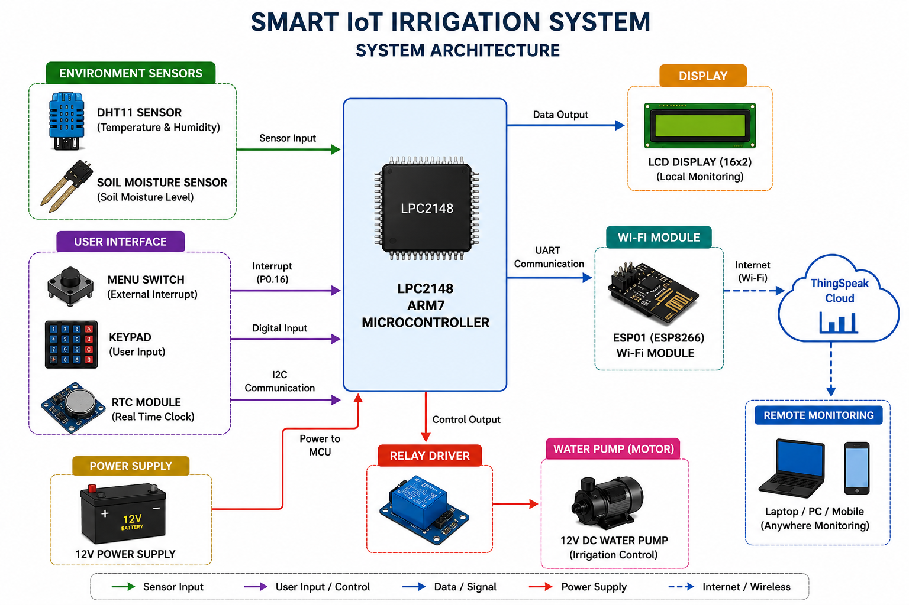
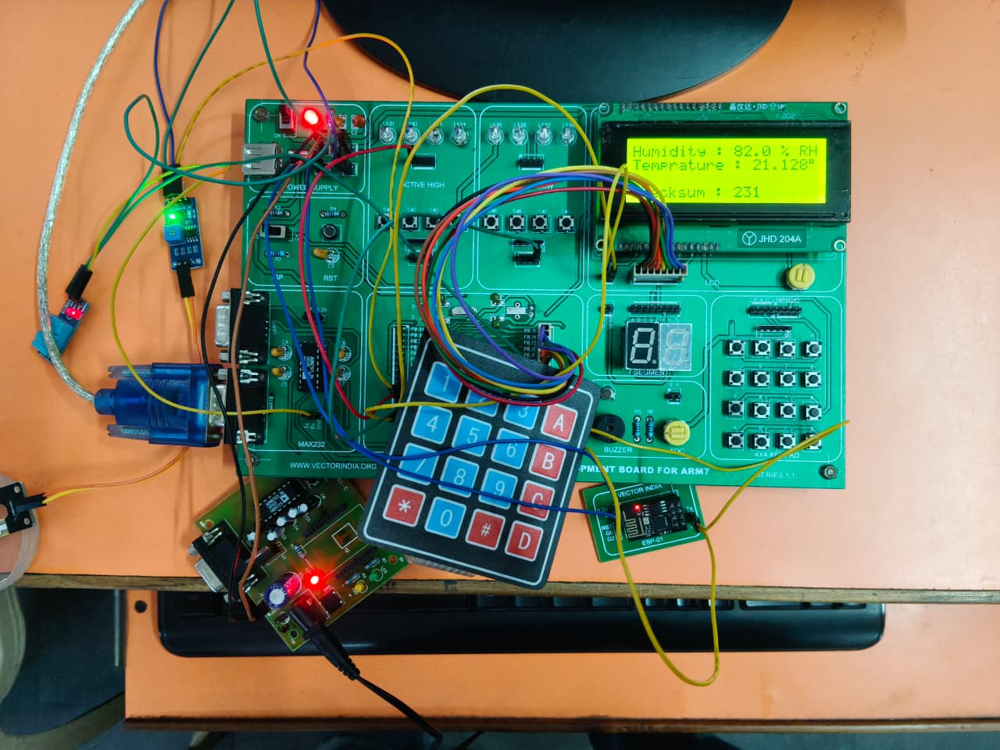
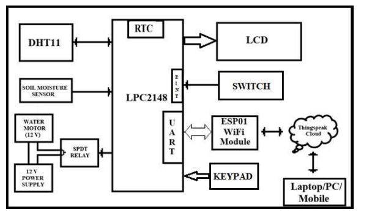
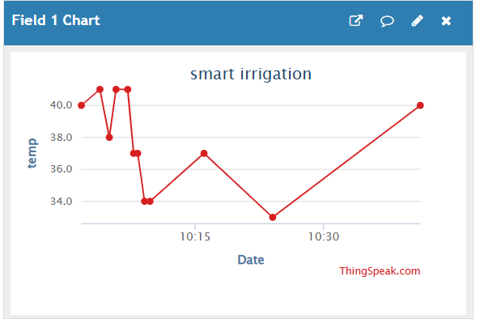
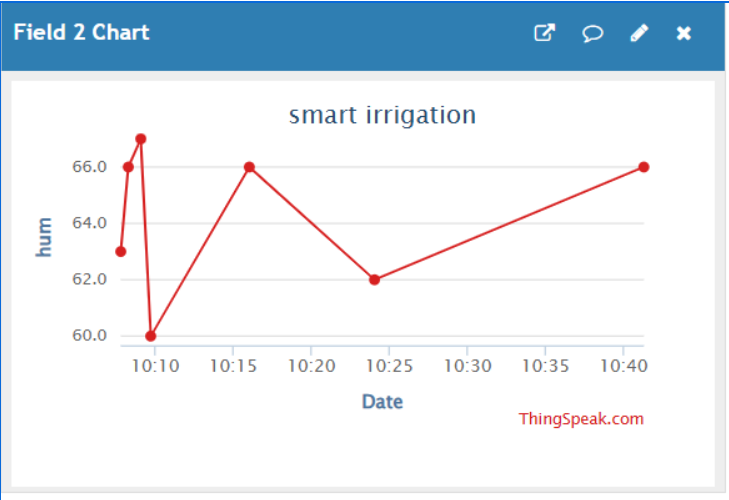
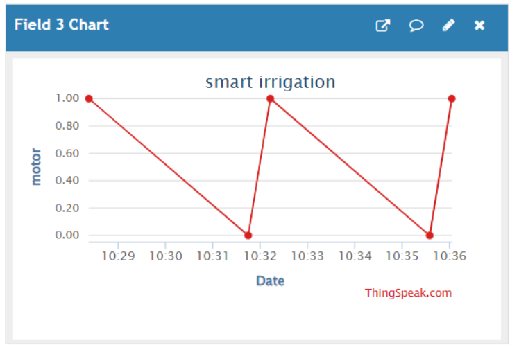

# 🌱 SMART-IOT-IRRIGATION-SYSTEM

An IoT-based Smart Irrigation System using the **LPC2148 ARM7 Microcontroller**, designed to automate irrigation by monitoring **temperature**, **humidity**, and **soil moisture** conditions in real time.  

The system automatically controls the irrigation motor and uploads live environmental data to the **ThingSpeak Cloud Platform** using the **ESP01 (ESP8266) Wi-Fi module**.

---

# 📖 Project Overview

The **Smart IoT Irrigation System** is an embedded IoT-based automation project developed for modern agricultural applications. The system continuously monitors environmental parameters such as:

- 🌡️ Temperature
- 💧 Relative Humidity
- 🌱 Soil Moisture

using the **DHT11 sensor** and **soil moisture sensor**.

The collected sensor data is:
- Displayed locally on the LCD display
- Uploaded to ThingSpeak cloud for remote monitoring
- Used for automatic irrigation control

Based on:
- Soil moisture condition
- Temperature
- Humidity
- User-defined irrigation settings

the system automatically controls the **water motor** using a **relay module**.

This project helps:
- Reduce water wastage
- Minimize manual irrigation effort
- Improve agricultural efficiency
- Enable remote monitoring through IoT

---

# 🎯 Aim of the Project

The main aim of this project is to design and implement an **IoT-based Smart Irrigation System** capable of:

- Monitoring temperature, humidity, and soil moisture
- Automating irrigation based on environmental conditions
- Uploading real-time data to ThingSpeak cloud
- Providing intelligent irrigation control
- Reducing water consumption
- Improving smart farming efficiency

---

# ✨ Features

- Real-time Temperature Monitoring
- Real-time Humidity Monitoring
- Soil Moisture Detection
- Automatic Water Pump Control
- ESP01 Wi-Fi Communication
- ThingSpeak Cloud Monitoring
- UART Interrupt Communication
- LCD Display Monitoring
- RTC-Based Timed Data Upload
- Menu-Driven User Interface
- Keypad-Based Configuration
- User-Configurable Irrigation Timing
- Multiple Irrigation Modes

---

# 🔧 Hardware Requirements

The following components are used in this project:

| Component | Description |
|---|---|
| LPC2148 | ARM7 Microcontroller |
| DHT11 Sensor | Temperature & Humidity Sensor |
| Soil Moisture Sensor | Soil Monitoring |
| ESP01 (ESP8266) | Wi-Fi Module |
| LCD Display | Local Display Unit |
| Keypad | User Input |
| RTC Module | Real Time Clock |
| Relay Module | Motor Switching |
| Water Pump | Irrigation Control |
| Push Button | External Interrupt |
| 12V Power Supply | System Power |

---

# 💻 Software Requirements

| Software | Purpose |
|---|---|
| Keil µVision | Embedded C Development |
| Embedded C | Programming Language |
| Flash Magic | Flashing LPC2148 |
| ThingSpeak Cloud | IoT Monitoring |

---

# 🏗️ System Architecture

The following diagram shows the complete architecture of the Smart IoT Irrigation System including all hardware modules and communication interfaces.



### Explanation

The **LPC2148 ARM7 microcontroller** acts as the central processing unit of the system.

- The **DHT11 sensor** provides temperature and humidity data.
- The **soil moisture sensor** detects soil condition.
- The **ESP01 Wi-Fi module** uploads sensor data to ThingSpeak cloud using UART communication.
- The **LCD display** shows real-time environmental data locally.
- The **relay module** controls the water motor automatically.
- The **keypad** and **interrupt switch** allow user configuration and menu navigation.

The system enables automatic irrigation with cloud-based remote monitoring.

---

# 🔌 Hardware Setup

The following image shows the actual hardware implementation of the Smart IoT Irrigation System.



### Explanation

The hardware setup includes:
- LPC2148 development board
- DHT11 sensor
- ESP01 Wi-Fi module
- Soil moisture sensor
- LCD display
- Relay module
- Water motor
- RTC module
- Keypad interface

All hardware modules are interfaced using:
- GPIO communication
- UART communication
- Interrupt handling

The relay controls the irrigation motor according to soil moisture and user-defined settings.

---

# 📊 Block Diagram

The block diagram represents the detailed flow and interconnection between all system modules.



### Explanation

The block diagram illustrates:
- Sensor inputs to LPC2148
- UART communication with ESP01
- LCD output display
- Relay-controlled motor system
- User configuration through keypad
- Cloud communication via ThingSpeak

The LPC2148 continuously processes sensor data and performs automatic irrigation control logic.

---

# ⚙️ Working Principle

The Smart IoT Irrigation System continuously monitors environmental conditions and automatically controls irrigation based on sensor data and user-defined settings.

---

## Step 1: System Initialization

When the system is powered ON, the LPC2148 initializes:

- LCD display
- DHT11 sensor
- Soil moisture sensor
- ESP01 Wi-Fi module
- RTC module
- UART communication
- Keypad
- External interrupt

---

## Step 2: Sensor Monitoring

The system continuously reads:

- Temperature from DHT11
- Relative Humidity from DHT11
- Soil Moisture Level

The measured sensor values are displayed on the LCD in real time.

---

## Step 3: Interrupt-Based User Configuration

Whenever the user presses the external interrupt switch:

- LCD enters menu mode
- User navigates using keypad
- Irrigation settings can be configured

### Menu Option 1: Irrigation Timing Selection

The user can configure:
- 1 minute
- 2 minutes
- 3 minutes

motor ON duration depending on crop requirements.

---

### Menu Option 2: Temperature & Humidity Threshold Configuration

The user can configure irrigation timing based on environmental conditions.

### Example:

| Condition | Motor ON Duration |
|---|---|
| High Temperature + Low Humidity | 3 Minutes |
| Moderate Temperature + Moderate Humidity | 2 Minutes |
| Low Temperature + High Humidity | 1 Minute |

This enables intelligent irrigation based on field conditions.

---

## Step 4: Automatic Irrigation Control

The soil moisture sensor acts as the main decision parameter.

### If Soil is Dry:
- Relay turns ON
- Water motor starts
- Irrigation begins

### If Soil Becomes Wet:
- Relay turns OFF
- Motor stops automatically

This helps conserve water and improve irrigation efficiency.

---

## Step 5: UART Communication with ESP01

The LPC2148 communicates with ESP01 using UART interrupts.

### Important AT Commands

| Command | Purpose |
|---|---|
| `AT` | Check ESP response |
| `ATE0` | Disable Echo |
| `AT+CWJAP` | Connect Wi-Fi |
| `AT+CIPSTART` | Start TCP Connection |
| `AT+CIPSEND` | Send Data |

### Benefits of UART Interrupt Communication

- Faster response handling
- Efficient real-time communication
- Reliable transmission and reception
- Reduced CPU polling

---

## Step 6: Cloud Data Upload

The following data is uploaded to ThingSpeak cloud:

- Temperature
- Humidity
- Motor ON/OFF Status

This allows remote monitoring through:
- Laptop
- Mobile
- PC

---

# ☁️ ThingSpeak Cloud Outputs

The following outputs are obtained from the ThingSpeak Cloud Platform.

---

# 🌡️ Temperature Monitoring Output

The graph below shows the real-time temperature data uploaded from the DHT11 sensor to ThingSpeak cloud.



### Explanation

The DHT11 sensor continuously measures temperature values and uploads them periodically using the ESP01 Wi-Fi module.

The graph helps monitor:
- Environmental temperature
- Climate variation
- Irrigation requirements

in real time.

---

# 💧 Humidity Monitoring Output

The graph below shows the humidity data uploaded to ThingSpeak cloud.



### Explanation

Humidity values are continuously monitored and uploaded to the cloud platform.

The humidity graph helps analyze:
- Atmospheric moisture
- Weather conditions
- Irrigation efficiency

Humidity values are also used for automatic irrigation timing control.

---

# 🔄 Motor ON/OFF Status Output

The graph below represents irrigation motor operating status.



### Explanation

The motor status graph indicates:

- `1` → Motor ON
- `0` → Motor OFF

The motor operation depends on:
- Soil moisture conditions
- Temperature & humidity thresholds
- User-defined irrigation settings

This enables remote irrigation monitoring.

---

# 🚀 Project Flow

```text
Power ON
   ↓
Initialize Peripherals
   ↓
Read Sensor Values
   ↓
Display Data on LCD
   ↓
Check Soil Moisture
   ↓
Control Irrigation Motor
   ↓
Upload Data to Cloud
   ↓
Handle User Configuration
   ↓
Repeat Continuously
```

---

# 🌍 Applications

- Smart Agriculture
- Automated Irrigation Systems
- Greenhouse Automation
- IoT-Based Farming
- Water Conservation Systems
- Remote Environmental Monitoring

---

# 🔮 Future Enhancements

- Mobile Application Integration
- GSM/SMS Alert System
- Solar-Powered Irrigation
- AI-Based Irrigation Prediction
- Advanced Cloud Analytics
- Weather Forecast Integration

---

# 👨‍💻 Author

## D SAI PHANITHALPA SHARMA

Embedded Systems & IoT Enthusiast

---

# 📌 Conclusion

The **Smart IoT Irrigation System using LPC2148** successfully demonstrates the integration of:

- Embedded Systems
- Sensor Interfacing
- UART Communication
- IoT Technology
- Cloud Monitoring
- Automation

to develop an intelligent irrigation solution for modern agriculture.

The project effectively reduces:
- Water wastage
- Manual effort
- Irrigation inefficiency

while enabling:
- Smart farming
- Remote monitoring
- Intelligent irrigation automation

through cloud-connected embedded technology.

---
